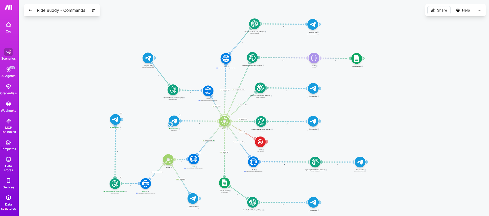
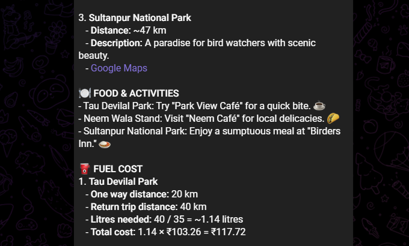
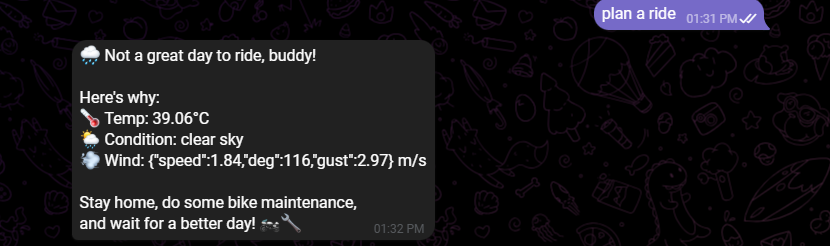
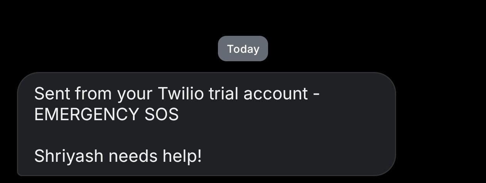
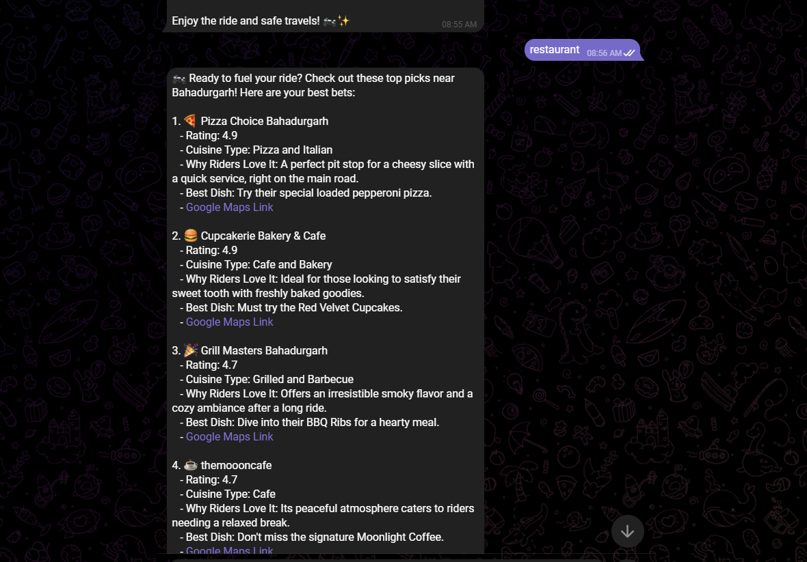
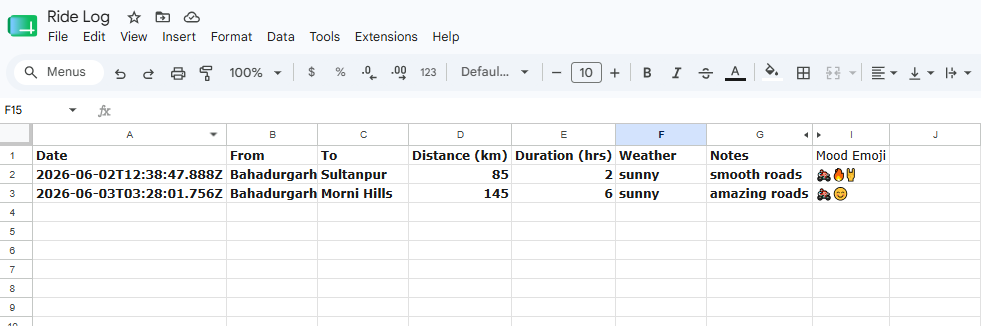
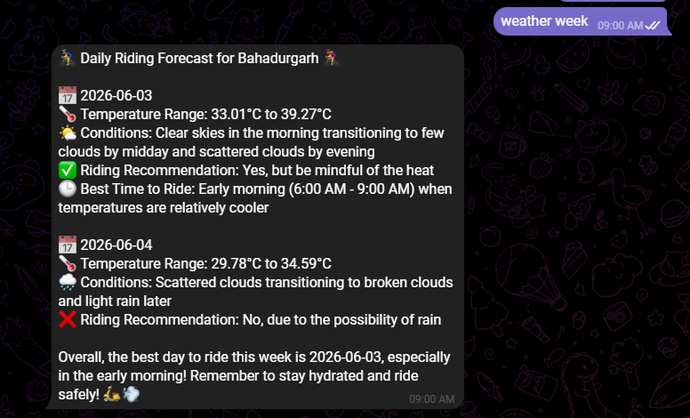

# Ride Buddy AI Assistant

## Overview

Ride Buddy is an AI-powered motorcycle travel assistant built using Make.com, OpenAI, Telegram, Google Maps, and Google Sheets.

The assistant helps riders discover destinations, find restaurants, log rides, send SOS/help messages, retrieve weather forecast and receive AI-generated recommendations directly through Telegram.

## Workflow Architecture

## Workflow Process

1. User sends a command through Telegram.
2. Make.com routes the request.
3. External APIs retrieve required information.
4. OpenAI processes and enriches the response.
5. Results are returned to Telegram.
6. Ride data is optionally stored in Google Sheets.

## Features

### Motorcycle Trip Recommendations

* Finds nearby tourist destinations
* Uses Google Maps Places API. Accepts when the weather is great (screenshot 1) and rejects in case the weather is unsuitable (screenshot 2).
* Generates AI-powered travel suggestions

### SOS / Emergency Assistance

Ride Buddy includes an SOS feature to help riders quickly request assistance during emergencies.

#### Current Capabilities
* Trigger emergency assistance through a Telegram command.
* Generate a predefined emergency alert message.
* Share essential information with emergency contacts.
* Reduce response time during roadside emergencies.

### Restaurant Recommendations

* Discovers highly-rated restaurants and bars
* Uses AI to summarize options
* Provides rider-focused recommendations

### Ride Logging

* Extracts ride information from messages
* Structures data into JSON format
* Stores ride information for future analysis

## Commands & Keywords

| Command | Description |
|---|---|
| ride | Checks live weather in Bahadurgarh and gives a full riding plan including places to visit within 150km, restaurants, fuel cost, ride difficulty, best time to start, fuel stops and packing list |
| places | Suggests 4 popular tourist destinations within 150km of Bahadurgarh with distances, descriptions and Google Maps links |
| restaurant | Finds top rated restaurants and bars nearby with ratings, cuisine type and rider friendly notes |
| log | Logs a ride to Google Sheets. Format: log: [from] to [to], [distance]km, [duration]hrs, [weather], [notes], mood [1-5] |
| sos/help | Sends an emergency alert to your emergency contact via WhatsApp and SMS using Twilio |
| bike check | Generates a detailed pre-ride checklist specifically for the Hero Xpulse 200 4V |
| moto fact | Sends a random interesting motorcycle fact, history or trivia |
| weather week | Gives a 7 day riding forecast for Bahadurgarh with daily ride recommendations |
| my stats | Pulls your Google Sheets ride history and generates a personal riding report with total km, favourite routes, mood analysis and suggestions |

## Example Usage
- Should I ride today?
- Show me places near me
- restaurant near me
- log: Bahadurgarh to Morni Hills, 145km, 3hrs, sunny, amazing roads, mood 5
- sos
- bike check
- moto fact
- weather week
- my stats

### Telegram Integration

* Accepts commands through Telegram
* Returns AI-generated responses
* Provides a conversational experience

## Technology Stack

* Make.com
* OpenAI GPT-4o
* Telegram Bot API
* Google Maps Places API
* Google Sheets
* HTTP APIs (OpenWeather)
* Twilio

## Repository Structure

* future enhancements
* prompts
* screenshots
* Readme

## Skills Demonstrated

* Workflow Automation
* Prompt Engineering
* API Integration
* AI Assistants
* Data Extraction
* Make.com Automation
* OpenAI Integration
